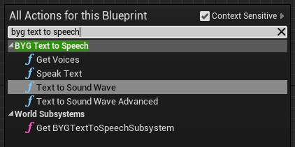
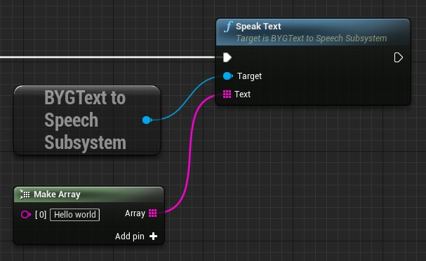

# BYG Text to Speech

A plugin for Unreal Engine that wraps Windows accessibility text-to-speech functionality.


## Note Before Using

This project is aimed at adding **text-to-speech for accessibility**. It will only work on Windows PCs that
have text-to-speech language packs **already installed**.

It is not suitable for general text-to-speech in games, e.g. "I want it to speak this text on all machines, because I
want all players to hear the spoken voice." It will only work for players that have the text-to-speech language packs
installed.


## Features

* Automatically read text under the cursor using UE4's built-in `GetAccessibleText()`.
* Blueprint functions for creating `USoundWave` instances from text.
* Settings for voice, speed, volume.
* Detects all installed voices. 
* Can handle large amounts of text without hitches (runs asynchronously, splits up long sentences).


## Installation

1. Download the zip or clone the repository to `ProjectName/Plugins/BYGTextToSpeech`.
2. Add `BYGTextToSpeech` to `.uproject` file
3. Add `BYGTextToSpeech` to `PrivateDependencyModuleNames` inside `ProjectName.Build.cs`.
4. Install ATL dependencies through Visual Studio. Run the Visual Studio 2019
   installer and under Individual Modules make sure that "C++ ATL for latest v142 build tools (x86 & x64) is checked".
   Check the path in `BYGTextToSpeech.Build.cs` is pointing to where they are installed (see [FAQ](#faq) for details)
6. Make sure that you have voices installed on your PC. Under Windows settings
   search for Speech. At the bottom under Manage Voices ensure that you have
   voices installed for the languages you wish to use.

## Usage

### Settings

Global default settings are exposed under `Project Settings > Plugins > BYG Text to Speech`.

### C++

```cpp
UBYGTextToSpeechSubsystem* TextToSpeech = Cast<UBYGTextToSpeechSubsystem>( GetWorld()->GetSubsystemBase( UBYGTextToSpeechSubsystem::StaticClass() ) );
if ( TextToSpeech )
{
    TextToSpeech->SetIsEnabled( true );
    TextToSpeech->SetAutoReadOnHoverEnabled( true );
    TextToSpeech->SetVolumeMultiplier( 1.0f );
    TextToSpeech->SetSpeed( 1.0f );
}
```

### Blueprints

Check the BYG Text to Speech category for functionality.



Most functionality is accessible through the BYG Text to Speech Subsystem.




## Limitations

* Windows only.
* Requires users to have voice packs installed for the language(s) they wish to
  use.


## Unreal Version Support

* Checked with 4.25 and 4.26.
* Compiles with 5.0EA but not tested, sorry!

## FAQ

### Q: I get the error "Cannot open include file: 'atlbase.h':  No such file or directory"

It's possible that the `AtlmfcFolder` variable inside
`BYGTextToSpeech.Build.cs` is pointing to the wrong place.

To find where it is installed on your machine, search inside `C:\Program Files (x86)\Microsoft Visual Studio\` for `atlbase.h`. Then change the path inside `BYGTextToSpeech.Build.cs` to match.

### Q: Does this work on Linux/Mac/iOS/Android?

No, it only works on Windows, and only if the player has the text-to-speech language packs installed.


## License

* [3-clause BSD license](LICENSE)
* Based on [yar3333/text-to-speech-ue4](https://github.com/yar3333/text-to-speech-ue4) and [indomitusgames/FMRTTSLib](https://github.com/indomitusgames/FMRTTSLib)


## Contact

* Created and maintained by [@_benui](https://twitter.com/_benui) at [Brace Yourself Games](https://braceyourselfgames.com/)
* Please report bugs through [GitHub](https://github.com/BraceYourselfGames/UE4-BYGTextToSpeech/issues)
